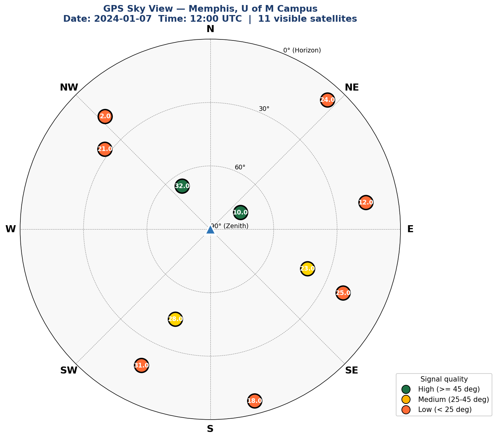

# GNSS Sensor Fusion & Kalman Filter & Orbit Determination Engine — C++

> **A from-scratch implementation of GNSS positioning algorithms in modern C++**, built as part of a structured 6-month curriculum targeting navigation engineering roles in spacecraft and ground GNSS systems.

[]()
[]()
[]()
[]()
[]()

---

## 🎯 About This Project

This repository documents my journey building a complete GNSS (Global Navigation Satellite System) processing engine in modern C++ — from coordinate transformations and Kalman filtering to satellite orbit computation and standalone point positioning.

**Each commit represents one day of focused study.** The progression is deliberately structured to mirror how real GNSS engineers think: starting with fundamentals (coordinate systems, Kalman filters), advancing to real-data parsing (NMEA, RINEX), and culminating in full positioning algorithms.

### **Goals**

- 🛰️ Implement GNSS positioning algorithms **from first principles** in modern C++17
- 📐 Master the mathematical foundations of geodesy, orbital mechanics, and state estimation
- 🧪 Validate every implementation against real research-grade data from NASA CDDIS / IGS
- 🛠️ Build a portfolio that demonstrates production-quality engineering practices

---

## 🌌 Sample Output

GPS sky view at the University of Memphis, January 7, 2024, 12:00 UTC — computed **entirely from raw broadcast ephemerides** using my own RINEX parser and Kepler solver:



*8 visible GPS satellites, color-coded by elevation. Center = directly overhead, edge = horizon.*

---

## 📊 Progress Tracker

| Month | Focus | Status |
|---|---|---|
| **Month 1** | Foundations: C++, geodesy, Kalman filters, NMEA + RINEX parsing | ✅ Complete |
| **Month 2** | GPS Positioning: ephemerides, satellite positions, visibility, sky plots | 🔄 In Progress (Week 5 ✅) |
| Month 3 | Kalman Positioning: 6/8-state KF, carrier phase, RTS smoothing, RAIM | ⏳ Upcoming |
| Month 4 | INS + Sensor Fusion: IMU, error-state EKF, loose & tight coupling | ⏳ Upcoming |
| Month 5 | Spacecraft Orbit Determination: J2, drag, SRP, batch & EKF estimation | ⏳ Upcoming |
| Month 6 | Real-Time + ROS 2: serial GPS, ROS 2 nodes, CI, documentation, demo | ⏳ Upcoming |

---

## 🏗️ Repository Structure

```
GNSS_SensorFusion_KF_Cpp/
├── Month1/
│   ├── Week1/    Coordinate systems & C++ fundamentals
│   ├── Week2/    The Kalman filter family (KF, EKF, UKF, PF)
│   ├── Week3/    Professional C++ workflow (CMake, Git, modular code)
│   └── Week4/    Real GNSS data parsing (NMEA, RINEX, folium maps)
├── Month2/
│   ├── Week5/    Satellite position from broadcast ephemerides ✅
│   ├── Week6/    Least-squares position solver (upcoming)
│   ├── Week7/    DOP analysis & sky plots (upcoming)
│   ├── Week8/    Atmospheric corrections (upcoming)
│   └── Week9/    MILESTONE #1: Full SPP processor (upcoming)
└── README.md
```

---

## ✅ Month 1 — Foundations (Complete)

### **Week 1 — C++ Fundamentals + GPS Coordinates**

Built the toolkit for geodesy:
- Coordinate transformations: **LLA ↔ ECEF ↔ ENU**
- Haversine great-circle distance computation
- Satellite class with elevation/azimuth calculation
- WGS84 ellipsoid mathematics
- Eigen library integration for matrix algebra

### **Week 2 — The Kalman Filter Family**

Five filter variants implemented from scratch:
| Filter | Application |
|---|---|
| **1D Linear KF** | GPS altitude tracking |
| **2D Linear KF** | Position tracking in plane |
| **Extended KF (EKF)** | Range-based positioning (non-linear) |
| **Unscented KF (UKF)** | Sigma-point estimation |
| **Particle Filter (PF)** | GPS-denied positioning |

### **Week 3 — Professional C++ Workflow**

- Modular header/implementation separation
- **CMake** build system (cross-platform)
- Git workflow with proper `.gitignore` and branching
- CSV logging via `std::ofstream`
- Python visualization with `pandas` + `matplotlib`

### **Week 4 — Real GNSS Data**

Crossed the bridge from simulated to real data:

- **NMEA parser** for `$GPGGA` and `$GPRMC` sentences (with CSV export)
- Real walking-path GPS data → interactive map using `folium`
- **RINEX 3 OBS header parser** — multi-GNSS support (GPS + GLONASS + Galileo + BeiDou)
- Tested against real CDDIS data: **BILL00USA station, IGS network**

---

## 🔄 Month 2 — GPS Positioning From First Principles (In Progress)

### **Week 5 — Satellite Position from Broadcast Ephemeris ✅**

Implemented the complete **IS-GPS-200 Section 20.3.3.4.3** algorithm:

#### **Day 1** — Theory: Keplerian orbital mechanics, 9-step algorithm overview
#### **Day 2** — Kepler solver in C++
- Iterative solution of `M = E − e·sin(E)` (transcendental equation)
- Full implementation of the 16-parameter broadcast ephemeris model
- Validation: orbit radius ≈ 26,560 km ✓

#### **Day 3** — RINEX 3 Navigation File Parser
- Parsed **440 GPS ephemerides** from `BRDC00IGS_R_20240070000_01D_MN.rnx`
- Handles Fortran-style scientific notation (`D` → `E`)
- Fixed-column extraction with defensive error handling
- Real data from **NASA CDDIS IGS archive**

#### **Day 4** — Multi-Satellite Visibility
- Best-ephemeris selection algorithm (closest in time per PRN)
- LLA → ECEF (WGS84)
- ECEF → ENU rotation matrix
- Elevation and azimuth computation for all visible satellites
- Receiver location: U of M Campus, Memphis (35.1186°N, 89.9387°W)

#### **Day 5** — Professional Sky Plot Visualization
- Polar plot of all visible satellites at a given epoch
- Color-coded by elevation (high/medium/low)
- Compass-convention compass directions (N at top, clockwise)
- PNG + PDF output for portfolio use

---

## 🛠️ Tech Stack

| Layer | Technology |
|---|---|
| **Language** | C++17 (modern features: structured bindings, `auto`, lambdas) |
| **Build** | CMake 3.15+ |
| **Linear Algebra** | Eigen 3.4 |
| **Visualization** | Python 3 + matplotlib + folium + pandas |
| **Version Control** | Git |
| **Data Sources** | NASA CDDIS, IGS, UNR Geodesy Lab |
| **Platform** | Windows (Visual Studio MSVC) — portable to Linux |

---

## 🧪 How to Build and Run

Each project folder is self-contained with its own `CMakeLists.txt`.

```bash
# Navigate to any project
cd Month2/Week5/3rd_All_Visible_Sats

# Configure
cmake -B build

# Build (Release for speed)
cmake --build build --config Release

# Run
cd build/Release
./all_visible_sats.exe
```

**Requirements:** CMake ≥ 3.15, C++17 compiler (MSVC/GCC/Clang), Eigen 3.4 (only for KF projects in Weeks 1–3).

---

## 📖 Key Engineering Concepts Demonstrated

- **State Estimation:** KF, EKF, UKF, Particle Filter
- **Orbital Mechanics:** Keplerian elements, satellite position from broadcast ephemerides
- **Coordinate Systems:** LLA, ECEF, ENU, transformations between them
- **Geodesy:** WGS84 ellipsoid, Haversine distance, great-circle geometry
- **Data Engineering:** NMEA parsing, RINEX 2/3 OBS and NAV parsing, multi-GNSS support
- **Modern C++17:** RAII, structured bindings, lambdas, `std::map`, `const &` semantics
- **Defensive Coding:** `safe_stod`, `safe_substr`, `nullptr` checks, week-rollover handling
- **Build Systems:** Cross-platform CMake configuration
- **Visualization:** Interactive maps (folium), polar sky plots (matplotlib)

---

## 👨‍💻 About Me

I'm **Hadi Heydarizadeh Shali**, a PhD candidate in Earth Sciences (Geodesy concentration) at the University of Memphis, expected graduation **December 2026**. My research focuses on GNSS time-series analysis, station velocity estimation, and ground deformation monitoring.

This portfolio bridges my academic background in geodesy with the C++ software engineering skills needed for industry navigation roles.

📫 **Contact:**
- Email: hadi.heydarizadeh@gmail.com
- LinkedIn: [linkedin.com/in/hadihshali](https://www.linkedin.com/in/hadihshali/)
- GitHub: [github.com/HadiHShali](https://github.com/HadiHShali)

---

## 📚 References

Implementations follow the official specifications and authoritative sources:

- **GPS Interface Specification IS-GPS-200** — Section 20.3.3.4.3 (satellite position algorithm)
- **Misra & Enge** — *Global Positioning System: Signals, Measurements, and Performance* (2nd ed.)
- **Kaplan & Hegarty** — *Understanding GPS/GNSS: Principles and Applications* (3rd ed.)
- **ESA Navipedia** — [GPS Satellite Coordinates Computation](https://gssc.esa.int/navipedia/index.php/GPS_Satellite_Coordinates_computation)
- **RINEX 3.04 Specification** — IGS Documentation
- **NASA CDDIS** — Continuous data archive for GNSS observations

---

## 📅 Updated Monthly

This README is updated at the end of each month with new accomplishments, screenshots, and milestones. **Last update: End of Week 5, Month 2.**

---

*Built one day at a time. The goal isn't speed — it's understanding every line.*
