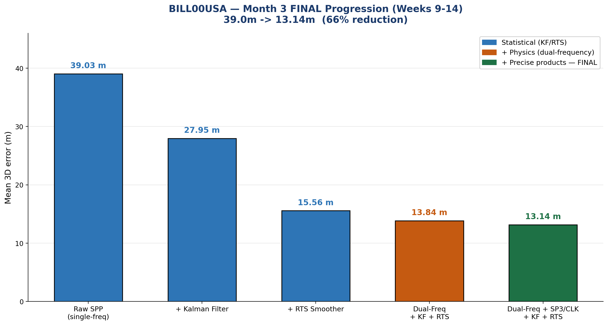

# GNSS Sensor Fusion & Kalman Filter & Orbit Determination Engine — C++

> **A from-scratch implementation of GNSS positioning algorithms in modern C++**, built as part of a structured 9-month curriculum targeting navigation and autonomy engineering roles in spacecraft and ground GNSS systems.

[]()
[]()
[]()
[]()
[]()

---

## What This Engine Does (as of Month 3 complete / Month 4 in progress)

**Core SPP pipeline (Months 1-2):**
- Parses RINEX 3 navigation and observation files
- Computes GPS satellite positions from broadcast ephemerides (IS-GPS-200)
- Applies full satellite clock corrections: polynomial (bias/drift/drift-rate), relativistic (Kepler-based), TGD
- Corrects for Earth rotation during signal travel (Sagnac effect)
- Applies elevation masking (configurable, default 10 deg)
- Models ionospheric delay via Klobuchar 8-parameter model
- Models tropospheric delay via Saastamoinen with standard atmosphere
- Solves receiver position via iterative weighted least-squares (Eigen)
- Computes 5 DOP quality metrics (GDOP/PDOP/HDOP/VDOP/TDOP)
- Processes multi-epoch RINEX files (24-hour trajectories)

**Kalman filtering & smoothing (Month 3, Weeks 10-12):**
- 8-state Kalman filter (position, velocity, clock bias, clock drift)
- Rauch-Tung-Striebel (RTS) fixed-interval smoother, forward+backward pass
- Friedland separate-bias estimator implemented and tested — formally diagnosed as
  **structurally unobservable** for single-station position bias (confirmed against
  Schmidt-Kalman filter literature), motivating the physics-based fixes below

**Physics-based accuracy improvements (Month 3, Weeks 13-14):**
- Dual-frequency ionosphere-free pseudorange combination (L1/L2, IS-GPS-200 standard)
- Precise orbit interpolation from IGS Final SP3 products (10th-order Lagrange)
- Precise clock interpolation from IGS Final CLK products (linear, per Kouba's guide)

**Carrier phase & differential positioning (Month 4, in progress):**
- Carrier phase observable parsing (L1C/L2W + LLI flags) from RINEX
- Cycle-slip detection: geometry-free (LG) and Melbourne-Wubbena (MW) combinations,
  cross-validated against receiver LLI flags across the full satellite constellation
- Single/double-difference formulation (in progress) using a real second GNSS station
  (DSSC, Southern California GPS Network) as an RTK base station

---

## Sample Results

Real BILL00USA IGS reference station, Jan 7 2024, 24-hour trajectory:

| Stage | Mean 3D Error |
|---|---|
| Raw single-frequency SPP | 39.0 m |
| + Kalman Filter | 28.0 m |
| + RTS Smoother | 15.6 m |
| + Dual-Frequency (ionosphere-free) | 13.84 m |
| **+ SP3/CLK Precise Products** | **13.14 m** |

**66% error reduction** achieved by systematically combining statistical filtering
(random-noise removal) with physics-based correction (systematic-bias removal) —
each technique's contribution validated against the specific error type it targets.




---

## Repo Structure

```
Month1/  Foundations — Kalman family, coordinates, RINEX basics
Month2/  GPS Positioning (COMPLETE)
  Week5/  Satellite ephemeris computation
  Week6/  Least-squares position solver
  Week7/  DOP analysis + sky plot visualization
  Week8/  Atmospheric corrections (Klobuchar + Saastamoinen)
  Week9/  Multi-epoch SPP processor + analysis
Month3/  Kalman Filtering, RTS, Dual-Frequency, Precise Products (COMPLETE)
  Week10/  8-state KF class + synthetic validation
  Week11/  KF on real BILL00USA data
  Week12/  RTS smoother + Friedland/observability analysis
  Week13/  Dual-frequency ionosphere-free combination
  Week14/  SP3/CLK precise orbit and clock products
Month4/  Carrier Phase, RTK, PPP (IN PROGRESS)
  Week15/  Carrier phase theory + cycle-slip detection (LG + Melbourne-Wubbena)
  Week16/  Single/double-differencing (in progress, base station: DSSC)
```

## Roadmap (9-Month Plan)

| Month | Weeks | Theme | Status |
|---|---|---|---|
| 1 | 1-4 | C++ Foundations | Complete |
| 2 | 5-9 | Kalman Filters / GPS SPP | Complete |
| 3 | 10-14 | GNSS Positioning: KF, RTS, Dual-Freq, Precise Products | Complete |
| 4 | 15-19 | Carrier Phase, RTK, PPP | In progress |
| 5 | 20-24 | INS/GPS Sensor Fusion (error-state EKF) | Planned |
| 6 | 25-29 | Orbit Determination + ROS 2 Intro | Planned |
| 7 | 30-34 | Perception (Camera / LiDAR / Radar) | Planned |
| 8 | 35-39 | SLAM | Planned |
| 9 | 40-44 | ROS 2 + Full Autonomy Fusion Capstone | Planned |

---

## Tech Stack

| Layer | Technology |
|---|---|
| **Language** | C++17 (modern features: structured bindings, `auto`, lambdas) |
| **Build** | CMake 3.15+ |
| **Linear Algebra** | Eigen 3.4 |
| **Visualization** | Python 3 + matplotlib + pandas + numpy |
| **Version Control** | Git |
| **Data Sources** | NASA CDDIS (RINEX, SP3/CLK), IGS, NOAA CORS Network |
| **Platform** | Windows (Visual Studio MSVC) — portable to Linux |

---

## How to Build and Run

Each project folder is self-contained with its own `CMakeLists.txt`.

```bash
# Navigate to any project
cd Month3/Week14/4th_SP3_KF_RTS

# Configure
cmake -B build

# Build (Release for speed)
cmake --build build --config Release

# Run
cd build/Release
./kf_spp_processor.exe
```

**Requirements:** CMake >= 3.15, C++17 compiler (MSVC/GCC/Clang), Eigen 3.4.

---

## Key Engineering Concepts Demonstrated

- **State Estimation:** Kalman Filter, RTS fixed-interval smoothing, separate-bias
  (Friedland) estimation, formal observability analysis
- **Physics-Based Error Correction:** dual-frequency ionosphere elimination,
  precise orbit/clock products, periodic relativistic correction
- **Carrier Phase Processing:** cycle-slip detection (geometry-free, Melbourne-Wubbena),
  differential positioning (single/double-difference)
- **Orbital Mechanics:** Keplerian elements, satellite position from broadcast
  ephemerides, Lagrange interpolation of precise orbits
- **Coordinate Systems:** LLA, ECEF, ENU, transformations between them
- **Geodesy:** WGS84 ellipsoid, geodetic datums, reference frames
- **Data Engineering:** RINEX 3 OBS/NAV parsing (dynamic column resolution), SP3/CLK
  parsing, multi-station data alignment
- **Modern C++17:** RAII, structured bindings, lambdas, `std::map`, `const &` semantics
- **Numerical Methods:** Lagrange polynomial interpolation, linear interpolation,
  least-squares estimation
- **Defensive Coding:** dynamic RINEX header parsing, graceful fallback (precise to broadcast),
  numerical hand-verification of every non-trivial formula before trusting results
- **Engineering Rigor:** every major result cross-validated against an independent
  method (LG vs MW cycle-slip detection) before being reported

---

## Engineering Practice: Research-Verified, Numerically Validated

Every technical claim in this repository is checked against current literature
(IS-GPS-200, Kouba's IGS Products Guide, GAMIT/GLOBK documentation, peer-reviewed
GNSS journals) before implementation, and every non-trivial formula is verified
numerically against real data before being trusted. This approach caught several
real bugs during development — including a unit-mismatch error in the geometry-free
combination and a gap-handling logic error in cycle-slip detection — both found by
computing expected values by hand and comparing against actual program output.

---

## About Me

I'm **Hadi Heydarizadeh Shali**, a PhD candidate in Earth Sciences (Geodesy concentration) at the University of Memphis, expected graduation **December 2026**. My research focuses on GNSS time-series analysis, station velocity estimation, and ground deformation monitoring.

This portfolio bridges my academic background in geodesy with the C++ software engineering skills needed for industry navigation and autonomy roles.

**Contact:**
- Email: hadi.heydarizadeh@gmail.com
- LinkedIn: [linkedin.com/in/hadihshali](https://www.linkedin.com/in/hadihshali/)
- GitHub: [github.com/HadiHShali](https://github.com/HadiHShali)

---

## References

Implementations follow official specifications and authoritative sources:

- **GPS Interface Specification IS-GPS-200** — satellite position algorithm, TGD, relativistic correction
- **Misra & Enge** — *Global Positioning System: Signals, Measurements, and Performance* (2nd ed.)
- **Kaplan & Hegarty** — *Understanding GPS/GNSS: Principles and Applications* (3rd ed.)
- **Kouba, J.** — *A Guide to Using International GNSS Service (IGS) Products*
- **Friedland, B. (1969)** — "Treatment of Bias in Recursive Filtering," IEEE Trans. Automatic Control
- **Rauch, Tung, Striebel (1965)** — "Maximum Likelihood Estimates of Linear Dynamic Systems," AIAA Journal
- **ESA Navipedia** — GPS Satellite Coordinates Computation, Ionosphere-Free Combination
- **RINEX 3.04 Specification** — IGS Documentation
- **GAMIT/GLOBK Documentation** (MIT) — cycle-slip detection, linear combinations
- **NASA CDDIS** — RINEX, SP3, and CLK data archive
- **NOAA CORS Network / SCGN** — differential base station data

---

## Updated Monthly

This README is updated at the end of each month with new accomplishments, screenshots, and milestones. **Last update: Month 4, Week 16 (in progress).**

---

*Built one day at a time. The goal isn't speed — it's understanding every line.*
